# Sistem Manajemen & Pelacakan Dokumen Internal - PT USTP

Sistem informasi manajemen dan pelacakan (*tracking*) dokumen fisik internal berbasis **Django** yang dirancang untuk divisi resepsionis/administrasi serta seluruh karyawan PT USTP. Sistem ini mengintegrasikan portal pelacakan mandiri (*self-service*) untuk karyawan dengan dasbor operasional terpusat untuk resepsionis.

---

## 📌 Status Progres Proyek

Aplikasi saat ini telah memasuki tahap penyempurnaan fitur inti (Core Features & Business Logic Hardening). Sistem telah dilengkapi validasi data relasional multi-entitas, sinkronisasi otomatis identitas karyawan dan rekanan PT, perlindungan privasi data portal mandiri berbasis sesi dan anti-cache, serta pengelolaan kredensial aman berbasis *environment variables*.

---

## ✨ Fitur & Kemajuan yang Telah Diimplementasikan

### 1. 🌐 Portal Pelacakan Mandiri Karyawan (`/`)
- **Pelacakan Dokumen Mandiri (Self-Service):** Karyawan dapat melacak status surat/paket yang masuk maupun paket/dokumen yang dikirim tanpa perlu mengonfirmasi manual ke meja resepsionis.
- **Autentikasi Dua Faktor Sederhana (2-Factor Verification):** Pencarian riwayat dokumen dilindungi dengan verifikasi ganda: **NIK** dan **Tanggal Lahir** yang divalidasi langsung terhadap Master Data Karyawan.
- **Pencegahan Kebocoran Data (Privacy & Anti-Caching):**
  - **Pola PRG (*Post/Redirect/Get*):** Menggunakan penyimpanan sesi sekali pakai (*one-time flash session*) sehingga data pelacakan otomatis hilang saat halaman di-*refresh*, mencegah resubmisi form yang tidak disengaja.
  - **Header Anti-Cache Ketat:** Mengirim header HTTP `Cache-Control: no-store, no-cache, must-revalidate` untuk mencegah browser menyimpan salinan data sensitif karyawan di riwayat *cache*.
  - **Auto-Purge DOM:** Skrip *client-side* mendeteksi event `pagehide` dan `pageshow` untuk segera membersihkan tabel hasil pelacakan ketika tab ditutup atau dibuka kembali dari histori peramban.
- **Tampilan Riwayat Responsif:**
  - **Dokumen Masuk:** Menampilkan informasi kategori, tanggal diterima, pengirim, status (*Di Resepsionis* / *Sudah Diambil*), dan stempel waktu pengambilan barang.
  - **Dokumen Keluar:** Menampilkan tautan langsung pelacakan resi ekspedisi (JNE) dan status penyerahan.
  - Tabel dilengkapi pembungkus *horizontal scroll* yang nyaman diakses lewat perangkat seluler (*smartphone*).

---

### 2. 🗂️ Master Data Terpusat

#### A. Master Data Karyawan (`Karyawan`)
- **Sumber Tunggal Kebenaran (*Single Source of Truth*):** Pengelolaan NIK unik, Nama Lengkap, dan Tanggal Lahir karyawan USTP.
- **Relasi & Integrasi Sistem:** Menjadi basis acuan validasi otomatis pada input resepsionis dan autentikasi pelacakan pada portal karyawan.

#### B. Master Data Rekanan PT / Instansi (`DataPT`)
- **Katalog Rekanan & Instansi Pengirim:** Pengelolaan daftar nama PT/instansi pihak ketiga yang sering mengirim dokumen ke kantor.
- **Relasi Dokumen Masuk:** Mempercepat pengisian data resepsionis dan menjaga konsistensi format penulisan nama instansi pengirim.

---

### 3. 📦 Manajemen Dokumen Masuk (`DokumenMasuk`)
- **Pencatatan Dokumen & Paket:**
  - **Kategori Terstandarisasi:** *Surat Resmi* dan *Paket Pribadi*.
  - **Fleksibilitas Pengirim:** Pilihan jenis pengirim antara **PT / Instansi** (memilih dari master `DataPT`) atau **Non-PT / Perseorangan** (input manual nama perseorangan).
  - **Dynamic Admin Form:** Form otomatis menyesuaikan tampilan input PT atau nama manual sesuai opsi yang dipilih, dilengkapi proteksi fallback di sisi backend.
- **Sinkronisasi 2-Arah Penerima:**
  - Dropdown interaktif antara **Nama Penerima** dan **NIK Penerima** di Dasbor Admin — memilih nama otomatis mengisi NIK, dan sebaliknya.
- **Validasi Serah Terima Berlapis (`clean()`):**
  - Memverifikasi bahwa NIK dan Nama penerima valid dan terdaftar di master data karyawan.
  - Saat status diubah menjadi *Sudah Diambil*, resepsionis wajib menginput **Tanggal Lahir Pengambil**. Sistem akan mencocokkan tanggal lahir tersebut dengan database sebelum memperbolehkan penyimpanan.
- **Otomatisasi Waktu Pengambilan Barang (`tanggal_diambil`):**
  - Tanggal dan jam pengambilan barang dicatat secara otomatis oleh sistem (`timezone.now()`) saat status berubah menjadi *Sudah Diambil*.
  - Riwayat waktu pengambilan dipertahankan jika data diedit kembali.
  - Jika status dikembalikan ke *Di Resepsionis*, waktu pengambilan otomatis direset.
  - Field diatur menjadi *read-only* pada Dasbor Admin untuk menjaga integritas audit.
- **Upload & Pratinjau Foto:** Upload bukti fisik paket/surat dengan *thumbnail* pratinjau langsung pada daftar tabel admin.

---

### 4. 📤 Manajemen Dokumen Keluar (`DokumenKeluar`)
- **Penomoran Resi Internal Otomatis (Incremental):**
  - Resi internal berformat `OUT-YYYYMMDD-001`, `OUT-YYYYMMDD-002`, dst., dibuat otomatis berdasarkan tanggal penyerahan ke resepsionis dan berurutan presisi setiap harinya.
- **Sinkronisasi Pengirim:**
  - Dropdown Nama Pengirim dan NIK Pengirim tersinkronisasi langsung dari Master Data Karyawan.
  - Validasi kecocokan NIK dan Nama Pengirim terhadap master data.
- **Standarisasi Status & Validasi Ekspedisi:**
  - Pilihan status: *Menunggu Kurir* dan *Sudah Diserahkan ke JNE*.
  - **Validasi Resi Ekspedisi:** Sistem mewajibkan pengisian URL Resi JNE jika status diubah menjadi *Sudah Diserahkan ke JNE*.
  - Field URL Resi JNE dilengkapi pencegahan *autocomplete browser* (`autocomplete="off"`) untuk mencegah salah pilih tautan resi sebelumnya.
- **Dokumentasi Fisik:** Penyimpanan deskripsi dokumen serta unggahan foto fisik sebelum paket diserahkan ke kurir.

---

### 5. 🎛️ Dasbor Resepsionis & Kustomisasi Django Admin
- **Branding Perusahaan:** Penyesuaian nama header dasbor (*"Dasbor Resepsionis USTP"*), judul situs (*"Admin USTP"*), dan indeks administrasi.
- **Filter & Pencarian Lintas Entitas:** Filter status, kategori, dan tanggal terima, serta pencarian instan berbasis NIK, nama pengirim/penerima, dan nomor resi internal.
- **Dukungan Widget Native:** Input tanggal menggunakan kalender *native* HTML5 (`type="date"`).
- **Format Parsing Waktu ISO:** Dukungan input format waktu *native* browser tanpa gangguan konflik lokalisasi sistem.
- **Lokalisasi Waktu:** Berjalan di zona waktu **WIB (`Asia/Jakarta`)** dengan format waktu dan antarmuka yang bersih.

---

### 6. 🔒 Keamanan & Praktik Terbaik (Best Practices)
- **Kredensial Aman:** `SECRET_KEY` Django telah dipindahkan ke *Environment Variable* (`DJANGO_SECRET_KEY`) dan tidak disimpan secara hardcode di repositori.
- **Manajemen Media Terisolasi:** Direktori `media/` dipisahkan secara terstruktur dan terdaftar dalam `.gitignore` untuk mencegah unggahan foto lokal bocor ke version control.

---

## 🛠️ Arsitektur & Struktur Direktori

```text
magang-ustp/
├── dokumen/                  # Aplikasi utama manajemen dokumen
│   ├── admin.py             # Konfigurasi Admin, form sync 2-arah, dynamic script
│   ├── apps.py              # Konfigurasi metadata aplikasi dokumen
│   ├── models.py            # Model Karyawan, DataPT, DokumenMasuk, DokumenKeluar
│   ├── views.py             # View Portal Karyawan, PRG pattern, cache-control
│   └── migrations/          # Riwayat migrasi database skema (0001 - 0011)
├── static/                  # File statis (CSS, JavaScript, Aset gambar)
│   └── img/                 # Logo perusahaan & ikon
├── media/                   # Direktori upload media pengguna (diabaikan git)
│   ├── foto_barang/         # Bukti foto dokumen/paket masuk
│   └── foto_dokumen/        # Bukti foto dokumen keluar
├── templates/               # Berkas template HTML
│   ├── lacak_dokumen.html   # Antarmuka responsif Portal Karyawan
│   └── admin/               # Kustomisasi template Django Admin
├── ustp_tracking/           # Modul konfigurasi proyek Django
│   ├── settings.py          # Konfigurasi aplikasi, env variable, media, zona waktu
│   ├── urls.py              # Pengalamatan routing portal, admin, dan media handler
│   └── wsgi.py              # Entry point deployment WSGI
├── db.sqlite3               # Database SQLite lokal
├── manage.py                # Utilitas CLI Django
├── .gitignore               # Konfigurasi file yang diabaikan Git
└── README.md                # Dokumentasi proyek
```

---

## 🚀 Panduan Menjalankan Aplikasi

### 1. Prasyarat
- **Python 3.10+**
- Virtual Environment (`env`) aktif

### 2. Langkah Menjalankan

1. **Aktifkan Virtual Environment:**
   - *PowerShell (Windows):*
     ```powershell
     .\env\Scripts\activate
     ```
   - *Bash / macOS / Linux:*
     ```bash
     source env/bin/activate
     ```

2. **Atur Environment Variable `DJANGO_SECRET_KEY`:**
   - *PowerShell (Windows):*
     ```powershell
     $env:DJANGO_SECRET_KEY="kunci-rahasia-django-anda"
     ```
   - *Command Prompt (CMD):*
     ```cmd
     set DJANGO_SECRET_KEY=kunci-rahasia-django-anda
     ```
   - *Bash / Linux / macOS:*
     ```bash
     export DJANGO_SECRET_KEY="kunci-rahasia-django-anda"
     ```

3. **Jalankan Migrasi Database:**
   ```bash
   python manage.py migrate
   ```

4. **Jalankan Development Server:**
   ```bash
   python manage.py runserver
   ```

5. **Akses Aplikasi via Browser:**
   - **Portal Karyawan (Pelacakan Mandiri):** `http://127.0.0.1:8000/`
   - **Dasbor Resepsionis (Admin):** `http://127.0.0.1:8000/admin/`

---

## 📋 Alur Kerja Sistem (Workflow)

```mermaid
graph TD
    subgraph Dokumen Masuk
        A[Surat / Paket Tiba di Resepsionis] --> B[Resepsionis Buka Dasbor Admin]
        B --> C[Pilih Jenis: PT atau Non-PT]
        C --> D[Pilih Penerima via Dropdown Karyawan]
        D --> E[Simpan: Status 'Di Resepsionis']
        E --> F{Karyawan Datang Mengambil?}
        F -- Ya --> G[Resepsionis Minta Tanggal Lahir Karyawan]
        G --> H[Sistem Validasi DOB ke Data Karyawan]
        H -- Cocok --> I[Status Diubah ke 'Sudah Diambil']
        I --> J[Sistem Catat Waktu Pengambilan Otomatis]
    end

    subgraph Portal Karyawan
        K[Karyawan Akses Portal] --> L[Input NIK & Tanggal Lahir]
        L --> M[Verifikasi Sukses]
        M --> N[Tampilkan Riwayat Masuk & Keluar]
        N --> O[Refresh / Tutup Tab: Hasil Otomatis Direset]
    end

    subgraph Dokumen Keluar
        P[Karyawan Titip Dokumen Keluar] --> Q[Resepsionis Pilih Pengirim via Dropdown]
        Q --> R[Sistem Auto-Generate Resi OUT-YYYYMMDD-XXX]
        R --> S[Status: Menunggu Kurir]
        S --> T[Kurir JNE Ambil Dokumen]
        T --> U[Input URL Resi JNE & Ubah Status: Sudah Diserahkan ke JNE]
    end
```


