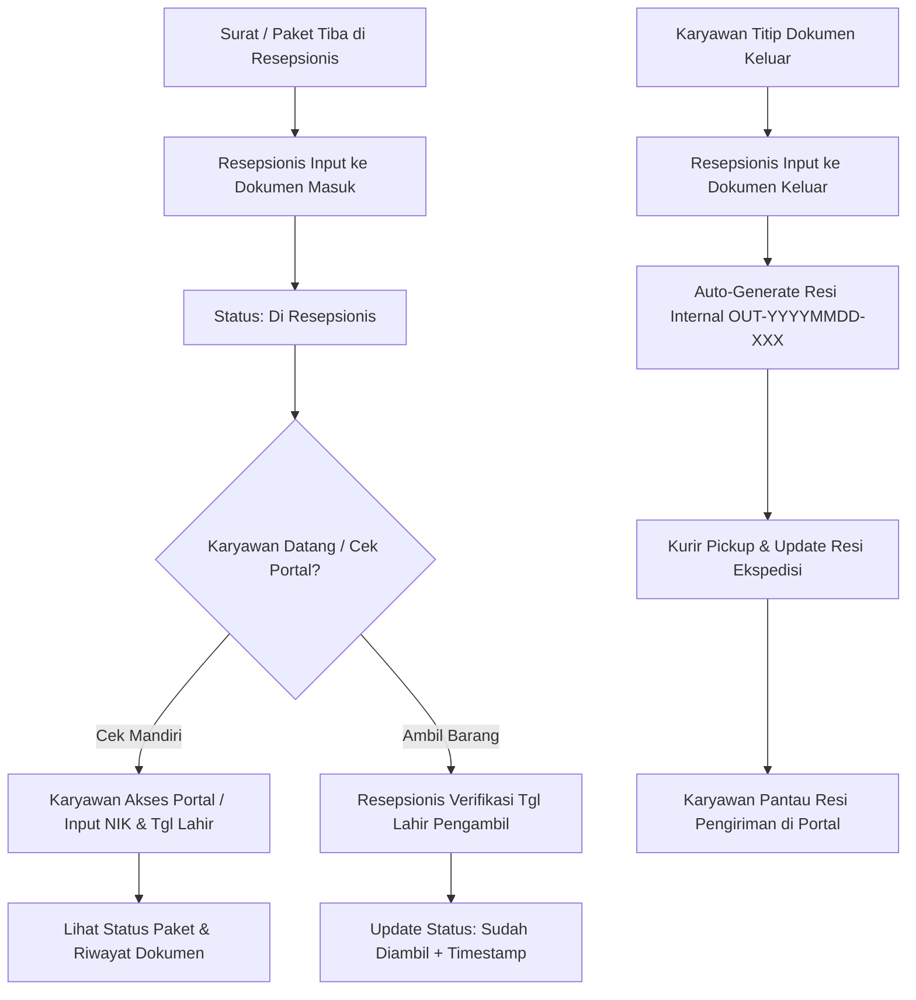

# Sistem Manajemen & Pelacakan Dokumen Internal - PT USTP

Sistem informasi pelacakan (*tracking*) dokumen dan paket internal berbasis **Django** yang dirancang untuk divisi resepsionis/administrasi serta karyawan PT USTP. Sistem ini menyediakan portal pelacakan mandiri (*self-service*) untuk karyawan dan dasbor administrasi terpusat untuk resepsionis.

---

## 📌 Status Progres Proyek

Proyek ini telah berkembang dari tahap awal MVP menuju platform yang lebih komprehensif dengan penambahan portal karyawan publik, master data karyawan terintegrasi, dan validasi keamanan berlapis.

---

## ✨ Fitur & Kemajuan yang Telah Diimplementasikan

### 1. 🌐 Portal Pelacakan Mandiri Karyawan (`/`)
- **Pencarian Dokumen Mandiri:** Karyawan dapat melacak status surat/paket yang masuk maupun keluar tanpa harus bertanya langsung ke resepsionis.
- **Verifikasi Keamanan (2-Factor Verification):** Karyawan harus memasukkan **NIK** dan **Tanggal Lahir** yang diverifikasi langsung dengan Master Data Karyawan sebelum riwayat dokumen ditampilkan.
- **Tampilan Riwayat Komprehensif:** Menampilkan status terkini dokumen masuk (*Di Resepsionis* / *Sudah Diambil*) serta status dokumen keluar beserta tautan resi pengiriman ekspedisi (JNE).
- **Desain Responsif & Bersih:** Antarmuka modern dan ramah pengguna dengan pesan notifikasi yang jelas.

### 2. 👥 Master Data Karyawan (`Karyawan`)
- **Penyimpanan Terpusat:** Pengelolaan data NIK, Nama Lengkap, dan Tanggal Lahir karyawan.
- **Validasi Identitas:** Menjadi sumber acuan tunggal (*single source of truth*) untuk autentikasi pelacakan pada portal karyawan.

### 3. 📦 Manajemen Dokumen Masuk (`DokumenMasuk`)
- **Pencatatan Surat & Paket Masuk:** Meliputi data pengirim, nama penerima, NIK penerima, kategori (*Surat Resmi*, *Paket Pribadi*, *Inventaris IT*), dan tanggal terima.
- **Upload Bukti Foto Barang:** Dilengkapi pratinjau *thumbnail* langsung pada tabel daftar data.
- **Validasi Serah Terima Ketat:**
  - Status *Di Resepsionis* dan *Sudah Diambil*.
  - Jika status diubah menjadi *Sudah Diambil*, sistem mewajibkan pengisian **Tanggal Lahir Pengambil** (verifikasi identitas) dan **Waktu Pengambilan Barang** secara presisi (*date-time*).
- **Form Interaktif:** Input tanggal lahir dan waktu pengambilan menggunakan widget kalender dan waktu *native* (`datetime-local`) dengan penonaktifan autocomplete browser untuk kenyamanan input data.

### 4. 📤 Manajemen Dokumen Keluar (`DokumenKeluar`)
- **Auto-Generate Nomor Resi Internal:** Sistem secara otomatis membuat nomor resi internal unik berbasis tanggal (format: `OUT-YYYYMMDD-001`, `OUT-YYYYMMDD-002`, dst.).
- **Pencatatan Pengiriman:** Nama pengirim, NIK pengirim, deskripsi barang/dokumen, dan foto dokumen fisik.
- **Integrasi Resi Ekspedisi:** Penyimpanan tautan/URL Resi JNE untuk memudahkan pelacakan lanjutan di pihak kurir eksternal.
- **Pelacakan Status:** *Menunggu Kurir*, *Sedang Dikirim JNE*, dan *Selesai*.

### 5. 🎛️ Dasbor Resepsionis (Custom Django Admin)
- **Branding Perusahaan:** Logo resmi PT USTP, judul header dasbor, dan *site title* yang telah disesuaikan.
- **Filter Pintar:** Filter berdasarkan status, kategori, dan tanggal terima.
- **Pencarian Cepat:** Pencarian berdasarkan Nama, NIK, dan Nomor Resi Internal.
- **Widget *Recent Actions* Interaktif:** Panel aktivitas terkini yang dapat dilipat/dibuka (*collapsible/expand-collapse*) agar tampilan dasbor tetap rapi.
- **Pengurutan Otomatis:** Data terbaru selalu ditampilkan di urutan paling atas.
- **Penyesuaian Zona Waktu & Bahasa:** Menggunakan zona waktu **WIB (`Asia/Jakarta`)** dan teks antarmuka Bahasa Indonesia.

---

## 🛠️ Arsitektur & Struktur Direktori

```text
magang-ustp/
├── dokumen/                  # Aplikasi utama manajemen dokumen
│   ├── admin.py             # Kustomisasi Django Admin & form overrides
│   ├── models.py            # Model Karyawan, DokumenMasuk, DokumenKeluar
│   ├── views.py             # View logika Portal Karyawan & verifikasi NIK/DOB
│   └── migrations/          # Riwayat migrasi database
├── static/                  # File statis (CSS, JavaScript, Gambar)
│   └── img/                 # Aset gambar (logo_ustp.png, dll.)
├── media/                   # Direktori upload media pengguna
│   ├── foto_barang/         # Foto bukti barang masuk
│   └── foto_dokumen/        # Foto bukti dokumen keluar
├── templates/               # Template HTML
│   ├── lacak_dokumen.html   # Halaman utama Portal Karyawan
│   └── admin/               # Override template Django Admin
│       ├── base_site.html   # Kustomisasi header & branding
│       └── index.html       # Dasbor admin dengan collapsible recent actions
├── ustp_tracking/           # Konfigurasi proyek Django
│   ├── settings.py          # Pengaturan aplikasi, media, zona waktu
│   └── urls.py              # Routing URL portal & admin
├── db.sqlite3               # Database SQLite
└── manage.py                # Utilitas CLI Django
```

---

## 🚀 Panduan Menjalankan Aplikasi

### 1. Prasyarat
- Python 3.10+
- Virtual Environment (`env`)

### 2. Langkah Menjalankan
1. **Aktifkan Virtual Environment:**
   - *PowerShell / Windows:*
     ```powershell
     .\env\Scripts\activate
     ```
   - *Bash / macOS / Linux:*
     ```bash
     source env/bin/activate
     ```

2. **Jalankan Migrasi Database (jika ada pembaruan model):**
   ```bash
   python manage.py migrate
   ```

3. **Jalankan Server Development:**
   ```bash
   python manage.py runserver
   ```

4. **Akses Aplikasi melalui Browser:**
   - **Portal Karyawan (Pelacakan Dokumen):** `http://127.0.0.1:8000/`
   - **Dasbor Resepsionis (Admin):** `http://127.0.0.1:8000/admin/`

---

## 📋 Alur Kerja Sistem (Workflow)


