# Sistem Manajemen & Pelacakan Dokumen & Paket Internal - PT USTP

Sistem informasi manajemen dan pelacakan (*tracking*) dokumen fisik dan paket kantor berbasis **Django** yang dirancang untuk divisi resepsionis/administrasi serta seluruh karyawan PT USTP. Sistem ini mengintegrasikan portal pelacakan mandiri (*self-service*) untuk karyawan dengan dasbor operasional terpusat untuk resepsionis berbasis Django Admin.

Repository: `lmaobilekpov/magang-ustp` (Branch: `main`)

---

## 📌 Status Progres Proyek

Aplikasi telah menyelesaikan tahap pembaruan arsitektur portal karyawan, perkuatan logika bisnis, audit trail riwayat status, dan pengujian menyeluruh:
- **22 Skenario Automated Unit Tests (100% Lulus)** mencakup validasi dokumen masuk, dokumen keluar, pencatatan riwayat status, dan portal karyawan.
- **Pemisahan Dasbor Portal Karyawan**: Halaman verifikasi mandiri (`/`), Dasbor Dokumen Aktif (`/dokumen-aktif/`), dan Dasbor Riwayat Selesai (`/riwayat/`).
- **Timeline Status Dokumen**: Visualisasi linimasa status dengan stempel waktu perubahan status. Pada Dasbor Admin, riwayat juga mencatat identitas staf/petugas yang melakukan perubahan.
- **Audit Trail Riwayat Status**: Model audit khusus (`RiwayatStatusDokumenMasuk` & `RiwayatStatusDokumenKeluar`) yang mencatat setiap transisi status dan user pengubah.
- **Alur Status Dokumen Keluar Satu Arah**: Memastikan dokumen keluar mematuhi alur transisi baku (*Menunggu Kurir → Sudah Diserahkan ke JNE → Paket Kembali*).
- **Penomoran Resi Internal Atomik**: Pembuatan nomor resi harian otomatis (`OUT-YYYYMMDD-001`) terlindung dari *race condition* melalui `transaction.atomic()` dan mekanisme percobaan ulang (*retry loop*).
- **Deteksi Keterlambatan Pengambilan Paket**: Properti model dan filter admin khusus untuk paket masuk yang belum diambil lebih dari 3 hari.
- **Tampilan Admin Rapi**: Penataan stylesheet khusus (`admin_custom.css`) untuk menghilangkan duplikasi label bawaan Django Admin dan merapikan spasi tabel inline.

---

## ✨ Fitur & Logika Bisnis yang Telah Diimplementasikan

### 1. 🌐 Portal Pelacakan Mandiri Karyawan

Portal karyawan dirancang aman, responsif, dan mudah diakses tanpa memerlukan pembuatan akun terpisah bagi setiap karyawan.

- **Verifikasi Mandiri Berbasis Tanggal Lahir (`/`):**
  - Karyawan cukup memasukkan **Tanggal Lahir** untuk melihat daftar dokumen miliknya.
  - **Penanganan Ambiguitas Tanggal Lahir:** Jika suatu tanggal lahir dimiliki oleh lebih dari satu karyawan di master data, sistem secara aman menolak akses dan meminta karyawan menghubungi resepsionis secara langsung.
- **Pemisahan Halaman Dokumen Aktif vs Riwayat Selesai:**
  - **Dokumen Aktif (`/dokumen-aktif/`):** Menampilkan surat dan paket yang masih berada dalam penanganan resepsionis (*Dokumen Masuk: 'Di Resepsionis'*; *Dokumen Keluar: 'Menunggu Kurir'* dan *'Sudah Diserahkan ke JNE'*).
  - **Riwayat Selesai (`/riwayat/`):** Menampilkan arsip dokumen yang telah selesai (*Dokumen Masuk: 'Sudah Diambil'*; *Dokumen Keluar: 'Paket Kembali'*). Dibatasi dengan masa retensi default 365 hari (`RIWAYAT_PORTAL_HARI = 365`).
- **Timeline Status Interaktif:**
  - Setiap kartu dokumen menyajikan linimasa visual transisi status dari status awal hingga status terkini.
  - Menampilkan perubahan status beserta stempel waktu kejadian (identitas staf/petugas pencatat disimpan di database dan ditampilkan khusus pada Dasbor Admin untuk menjaga privasi operasional).
- **Tautan Pelacakan Ekspedisi Cerdas:**
  - Tautan URL Resi JNE hanya ditampilkan ketika paket berstatus *Sudah Diserahkan ke JNE*.
  - Jika paket berstatus *Paket Kembali*, tautan pelacakan ekspedisi otomatis disembunyikan.
- **Keamanan Sesi & Perlindungan Anti-Cache:**
  - Sesi verifikasi dicatat secara aman dalam sesi server (`request.session['karyawan_terverifikasi']`).
  - Mengirimkan header anti-cache ketat pada setiap respons portal (`Cache-Control: no-store, no-cache, must-revalidate, max-age=0`, `Pragma: no-cache`, `Expires: 0`).
  - Rute **Keluar Sesi (`/keluar/`)** untuk menghapus sesi terverifikasi kapan saja.

---

### 2. 🗂️ Master Data Terpusat

#### A. Master Data Karyawan (`Karyawan`)
- **Struktur Kolom:** `kode_karyawan`, `nama_lengkap`, `jabatan`, `tanggal_lahir`, dan flag `aktif`.
- **Sumber Data:** Diimpor dari master data Excel internal perusahaan.
- **Validasi Keaktifan:** Karyawan non-aktif (`aktif=False`) tidak dapat dipilih untuk penerimaan atau pengiriman dokumen baru, namun integritas data dokumen lama tetap dipertahankan.
- **Input Disambiguasi pada Admin:** Menggunakan widget custom `KaryawanDatalistWidget` dengan format pilihan `Nama Lengkap` dan label petunjuk `Kode Karyawan — Jabatan`.

#### B. Master Data Supplier (`Supplier`)
- **Struktur Kolom:** `kode_supplier` dan `nama_supplier`.
- **Penyimpanan Lokal Andal (*Local Copy*):** Menyimpan salinan data rekanan/supplier di database lokal agar operasional resepsionis tetap berjalan meskipun sistem API/database pusat sedang tidak dapat diakses.
- **Pencarian Autocomplete Cepat:** Menggunakan fitur `autocomplete_fields` pada Django Admin untuk memudahkan pencarian instan di antara ribuan rekanan/supplier tanpa memperlambat loading browser.

---

### 3. 📦 Manajemen Dokumen Masuk (`DokumenMasuk`)

- **Kategori Dokumen:** Terstandarisasi menjadi `Surat Resmi` dan `Paket Pribadi`.
- **Fleksibilitas Jenis Pengirim:**
  - **PT / Instansi:** Dipilih dari Master Data `Supplier` dengan pencarian autocomplete. Form admin otomatis memetakan nama supplier ke data pengirim.
  - **Non-PT / Perseorangan:** Input nama pengirim secara manual.
  - **Form Dinamis:** Skrip `static/js/dokumen_masuk_form.js` mengatur visibilitas field supplier dan input manual secara instan sesuai pilihan jenis pengirim.
- **Validasi Penerima:** Nama penerima divalidasi harus cocok dengan data karyawan yang masih aktif.
- **Verifikasi Pengambilan Barang:**
  - Pengambilan barang dapat dilakukan langsung oleh karyawan yang bersangkutan atau diwakilkan kepada rekan kerja dengan syarat menyebutkan **Tanggal Lahir (DOB)** karyawan pemilik barang.
  - Resepsionis wajib menginput tanggal lahir pengambil pada field `dob_pengambil` saat mengubah status menjadi *Sudah Diambil*.
- **Pencatatan Otomatis Waktu Pengambilan (`tanggal_diambil`):**
  - Stempel waktu pengambilan dicatat otomatis oleh sistem (`timezone.now()`) ketika status berubah ke *Sudah Diambil*.
  - Nilai waktu pengambilan dipertahankan jika dokumen diedit kembali di masa mendatang, dan direset jika status dikembalikan ke *Di Resepsionis*.
- **Peringatan Paket Terlambat Diambil:**
  - Properti `terlambat_diambil` mendeteksi paket berstatus *Di Resepsionis* yang belum diambil lebih dari 3 hari.
  - Dilengkapi filter khusus `TerlambatDiambilFilter` pada Django Admin serta indikator visual berwarna pada tabel resepsionis (`⚠ Terlambat` / `✓ Selesai`).
- **Audit Trail & Foto:**
  - Setiap perubahan status dicatat dalam `RiwayatStatusDokumenMasuk` dan disajikan pada tabel inline.
  - Unggahan foto fisik paket/surat opsional (`foto_barang/`) dengan pratinjau thumbnail di tabel admin.

---

### 4. 📤 Manajemen Dokumen Keluar (`DokumenKeluar`)

- **Validasi Pengirim:** Nama pengirim wajib terdaftar dan aktif di Master Data Karyawan.
- **Penomoran Resi Internal Otomatis:**
  - Format standar: `OUT-YYYYMMDD-001`, `OUT-YYYYMMDD-002`, dst.
  - Nomor urut selalu dimulai kembali dari `001` setiap pergantian hari.
  - Dilindungi blok transaksi atomik (`transaction.atomic()`) dengan *retry loop* (hingga 5 kali) untuk mencegah duplikasi nomor resi pada akses bersamaan.
- **Alur Status Satu Arah (One-Way Status Flow):**
  - Alur status yang diizinkan: `Menunggu Kurir` → `Sudah Diserahkan ke JNE` → `Paket Kembali`.
  - Sistem menolak perubahan status yang melompati tahapan (misalnya membuat dokumen baru langsung berstatus *Paket Kembali*).
- **Integrasi Ekspedisi (JNE):**
  - Input tautan URL Resi JNE wajib diisi ketika status diubah menjadi *Sudah Diserahkan ke JNE* atau *Paket Kembali* (sesuai validasi kode saat ini; kebutuhan URL resi khusus pada status *Paket Kembali* sebaiknya dikonfirmasi lebih lanjut berdasarkan kesepakatan SOP operasional).
  - Resi JNE dapat diklik langsung oleh karyawan dari portal saat status *Sudah Diserahkan ke JNE*.
- **Penanganan Paket Retur / Kembali:**
  - Dokumen yang gagal terkirim dan kembali ke kantor ditandai statusnya menjadi `Paket Kembali`.
  - Jika paket hendak dikirim ulang, sesuai SOP dibuatkan transaksi dokumen keluar baru (tidak menimpa transaksi lama).
- **Audit Trail & Foto:**
  - Perubahan status tercatat secara otomatis pada `RiwayatStatusDokumenKeluar`.
  - Unggahan foto fisik surat/resi pengiriman opsional (`foto_dokumen/`).

---

### 5. 🎛️ Dasbor Resepsionis & Kustomisasi Django Admin

- **Branding USTP:** Header dasbor disesuaikan menjadi *"Dasbor Resepsionis USTP"* dan judul portal *"Admin USTP"*. Group bawaan dinonaktifkan (`unregister(Group)`) demi kesederhanaan operasional.
- **Kustomisasi Tampilan Rapi (`static/css/admin_custom.css`):**
  - Menyembunyikan string objek bawaan Django yang redundan di baris `TabularInline`.
  - Merapikan padding dan line-height baris riwayat status agar kompak dan nyaman dipandang.
- **Form Interaktif (`static/js/dokumen_masuk_form.js`):** Menampilkan input supplier atau input manual pengirim secara dinamis tanpa perlu me-refresh halaman.
- **Keamanan Hak Akses Inline:** Komponen riwayat perubahan status diatur murni sebagai tampilan baca (*view-only*) tanpa izin penambahan, pengubahan, atau penghapusan manual.
- **Lokalisasi Waktu:** Berjalan di zona waktu **WIB (`Asia/Jakarta`)** dengan widget pemilih tanggal kalender HTML5 native.

---

### 6. 🧪 Pengujian Otomatis (Automated Unit Tests)

Sistem dilengkapi test suite lengkap di `dokumen/tests.py` dengan total **22 skenario pengujian otomatis**:

1. **`DokumenMasukTest` (8 Skenario):**
   - Otomatisasi pencatatan waktu pengambilan saat status *Sudah Diambil*.
   - Penolakan status *Sudah Diambil* jika tanggal lahir pengambil tidak diisi.
   - Penolakan status *Sudah Diambil* jika tanggal lahir pengambil salah / tidak cocok.
   - Stempel waktu pengambilan lama dipertahankan saat data diedit ulang.
   - Dokumen berstatus *Di Resepsionis* dipastikan tidak memiliki waktu pengambilan.
   - Penolakan nama penerima yang tidak terdaftar di master data.
   - Penolakan nama penerima yang berstatus karyawan non-aktif pada transaksi baru.
   - Pemastian dokumen lama tetap dapat diedit meskipun karyawan penerima telah berstatus non-aktif.

2. **`DokumenKeluarTest` (8 Skenario):**
   - Pembuatan nomor resi internal otomatis dengan format `OUT-YYYYMMDD-001`.
   - Penolakan status *Sudah Diserahkan ke JNE* jika URL resi ekspedisi kosong.
   - Urutan penomoran resi internal bertambah secara konsisten (`001`, `002`, `003`).
   - Reset nomor urut resi kembali ke `001` saat berganti tanggal.
   - Validasi nama pengirim terdaftar berhasil disimpan.
   - Penolakan nama pengirim yang tidak terdaftar di master data.
   - Penolakan nama pengirim yang berstatus karyawan non-aktif pada transaksi baru.
   - Penolakan pembuatan dokumen baru yang langsung berstatus *Paket Kembali*.

3. **`StatusHistoryTest` (3 Skenario):**
   - Pencatatan status awal dan histori transisi status pada Dokumen Masuk.
   - Pencegahan penambahan riwayat jika status dokumen masuk tidak mengalami perubahan.
   - Pencatatan identitas pengguna/staf yang mengubah status pada Dokumen Keluar.

4. **`PortalKaryawanTest` (3 Skenario):**
   - Keberhasilan verifikasi identitas menggunakan tanggal lahir yang valid.
   - Penolakan verifikasi jika tanggal lahir tidak ditemukan di master data.
   - Penolakan verifikasi jika terdapat lebih dari satu karyawan dengan tanggal lahir yang sama.

---

### 7. 🔒 Keamanan, Konfigurasi & Batasan Desain

- **Keamanan Kredensial:** Menggunakan environment variable `DJANGO_SECRET_KEY` sehingga tidak ada kunci rahasia yang tersimpan di repositori publik/git.
- **Isolasi Berkas Pengguna:** Direktori `media/` dipisahkan secara terstruktur dan diabaikan oleh git melalui `.gitignore`.
- **Batasan Ruang Lingkup & Desain MVP:**
  - Sistem difokuskan pada alur kerja dokumen fisik dan paket internal resepsionis.
  - Tidak menggunakan notifikasi pihak ketiga (seperti WhatsApp API atau email blast) pada tahap MVP.
  - Integrasi ekspedisi kurir mengandalkan tautan URL pelacakan langsung (tanpa scraping/API kurir pihak ketiga).
  - Verifikasi pengambilan paket cukup mengandalkan validasi tanggal lahir pemilik barang tanpa memerlukan entitas perwakilan terpisah.
  - Kebutuhan wajibnya URL Resi JNE saat status *Paket Kembali* diimplementasikan pada kode untuk menjamin jejak pelacakan awal tersimpan, namun perlu dikonfirmasi kembali sesuai kesepakatan SOP operasional divisi terkait.

---

## 🛠️ Arsitektur & Struktur Direktori

```text
magang-ustp/
├── dokumen/                  # Aplikasi utama manajemen dokumen & paket
│   ├── admin.py             # Konfigurasi Admin, form custom, inline riwayat, filter
│   ├── apps.py              # Konfigurasi metadata aplikasi
│   ├── models.py            # Model Karyawan, Supplier, DokumenMasuk, DokumenKeluar, RiwayatStatus
│   ├── tests.py             # 22 skenario automated unit tests
│   ├── views.py             # View Portal Karyawan, verifikasi DOB, dokumen aktif, riwayat
│   └── migrations/          # Riwayat migrasi skema database
├── static/                  # Berkas statis
│   ├── css/
│   │   └── admin_custom.css # CSS kustom perapian inline Django Admin
│   ├── js/
│   │   └── dokumen_masuk_form.js # Handler dinamis form pengirim PT vs Non-PT
│   └── img/                 # Logo & aset visual
├── media/                   # Direktori upload media (diabaikan git)
│   ├── foto_barang/         # Bukti foto dokumen/paket masuk
│   └── foto_dokumen/        # Bukti foto dokumen keluar
├── templates/               # Berkas template antarmuka
│   ├── lacak_dokumen.html   # Halaman verifikasi tanggal lahir portal karyawan
│   ├── dokumen_aktif.html   # Dasbor dokumen & paket yang sedang berjalan
│   ├── riwayat_dokumen.html # Dasbor riwayat dokumen yang telah selesai
│   └── admin/               # Template override Django Admin
├── ustp_tracking/           # Modul konfigurasi proyek Django
│   ├── settings.py          # Konfigurasi aplikasi, env variable, media, zona waktu WIB
│   ├── urls.py              # Rute URL portal, admin, dan static/media handler
│   └── wsgi.py              # Entry point WSGI deployment
├── db.sqlite3               # Database SQLite lokal
├── manage.py                # Utilitas CLI Django
├── PROJECT_CONTEXT.md       # Dokumentasi konteks & keputusan bisnis proyek
├── .gitignore               # Konfigurasi berkas yang diabaikan Git
└── README.md                # Dokumentasi utama proyek
```

---

## 🚀 Panduan Menjalankan Aplikasi

### 1. Prasyarat
- **Python 3.10+**
- Virtual Environment aktif

### 2. Langkah Menjalankan

1. **Aktifkan Virtual Environment:**
   - *PowerShell (Windows):*
     ```powershell
     .\env\Scripts\activate
     ```
   - *Command Prompt (CMD):*
     ```cmd
     env\Scripts\activate.bat
     ```
   - *Bash / macOS / Linux:*
     ```bash
     source env/bin/activate
     ```

2. **Atur Environment Variable `DJANGO_SECRET_KEY` (Opsional untuk Dev):**
   - *PowerShell:*
     ```powershell
     $env:DJANGO_SECRET_KEY="kunci-rahasia-django-anda"
     ```
   - *Command Prompt (CMD):*
     ```cmd
     set DJANGO_SECRET_KEY=kunci-rahasia-django-anda
     ```
   - *Bash / Linux / macOS:*
     ```bash
     export DJANGO_SECRET_KEY="kunci-rahasia-django-anda"
     ```

3. **Jalankan Migrasi Database:**
   ```bash
   python manage.py migrate
   ```

4. **Jalankan Automated Tests:**
   ```bash
   python manage.py test
   ```

5. **Jalankan Development Server:**
   ```bash
   python manage.py runserver
   ```

6. **Akses Antarmuka Aplikasi:**
   - **Portal Karyawan (Verifikasi):** `http://127.0.0.1:8000/`
   - **Dasbor Dokumen Aktif:** `http://127.0.0.1:8000/dokumen-aktif/`
   - **Dasbor Riwayat Selesai:** `http://127.0.0.1:8000/riwayat/`
   - **Dasbor Resepsionis (Admin):** `http://127.0.0.1:8000/admin/`

---

## 📋 Alur Kerja Sistem (Workflow)

```mermaid
graph TD
    subgraph "Dokumen Masuk"
        A[Surat / Paket Tiba di Resepsionis] --> B[Resepsionis Buka Dasbor Admin]
        B --> C{Pilih Jenis Pengirim}
        C -- PT / Instansi --> D[Pilih Supplier via Autocomplete]
        C -- Non-PT --> E[Input Nama Pengirim Manual]
        D --> F[Pilih Nama Penerima dari Data Karyawan Aktif]
        E --> F
        F --> G[Simpan: Status 'Di Resepsionis']
        G --> H{Cek Waktu Pengambilan}
        H -- "> 3 Hari Belum Diambil" --> I[Muncul Indikator '⚠ Terlambat']
        H -- Pengambilan Barang --> J[Resepsionis Minta Tanggal Lahir Pemilik Paket]
        J --> K{Sistem Validasi DOB ke Karyawan}
        K -- Cocok --> L[Ubah Status: 'Sudah Diambil']
        L --> M[Sistem Catat Waktu Pengambilan Otomatis]
        M --> N[Catat Riwayat Perubahan Status & Operator]
    end

    subgraph "Dokumen Keluar"
        O[Karyawan Titipkan Dokumen Keluar] --> P[Resepsionis Input Dokumen Baru]
        P --> Q[Pilih Pengirim dari Karyawan Aktif]
        Q --> R[Sistem Generate Nomor Resi OUT-YYYYMMDD-001 secara Atomik]
        R --> S[Status: 'Menunggu Kurir']
        S --> T[Kurir JNE Melakukan Pickup Dokumen]
        T --> U[Input URL Resi JNE & Ubah Status: 'Sudah Diserahkan ke JNE']
        U --> V{Status Pengiriman JNE}
        V -- Berhasil Terkirim --> W[Selesai]
        V -- Paket Retur / Gagal Kirim --> X[Tandai Status: 'Paket Kembali']
        X --> Y[Jika Kirim Ulang: Buat Transaksi Dokumen Keluar Baru]
    end

    subgraph "Portal Pelacakan Karyawan"
        Z[Karyawan Akses Portal /] --> AA[Input Tanggal Lahir]
        AA --> AB{Validasi Tanggal Lahir}
        AB -- Tidak Ditemukan --> AC[Tolak Akses]
        AB -- Tanggal Lahir Ganda --> AD[Tolak Akses & Minta Hubungi Resepsionis]
        AB -- Valid & Unik --> AE[Verifikasi Sukses: Sesi Aktif]
        AE --> AF[Akses Halaman Dokumen Aktif /dokumen-aktif/]
        AF --> AG[Lihat Surat/Paket Berjalan & Visual Timeline Status]
        AE --> AH[Akses Halaman Riwayat Selesai /riwayat/]
        AH --> AI[Lihat Arsip Dokumen Selesai Retensi 365 Hari]
        AE --> AJ[Keluar Sesi /keluar/: Reset Sesi & Proteksi No-Cache]
    end
```


